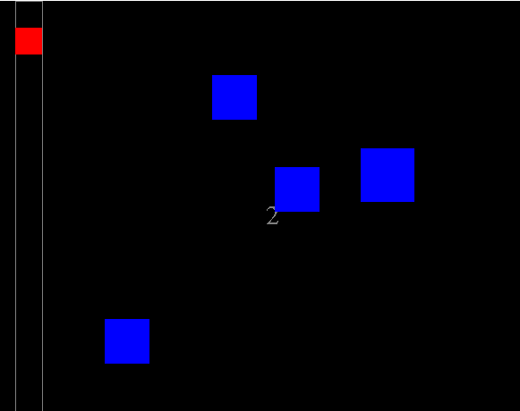

# Obstacle-Avoider

Slow down the square moving vertically to avoid the blue enemies moving in from the right. Collect power-ups that can shrink the square or give you a bonus point. Score is calculated based on the number of times the square hits the top or bottom. Reach the highest score you can.

Final project for AP Computer Science in 10th grade.

